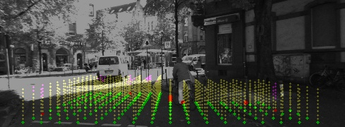
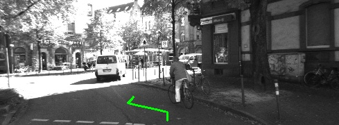
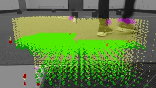
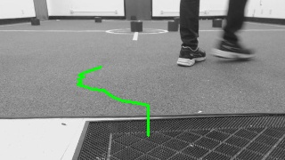

## Joint Perception and Planning For Efficient Obstacle Avoidance Using Stereo Vision

This repository contains a C++ implementation of JPP for local obstacle avoidance using stereo cameras. A ROS wrapper is also included in the `ROS/` 
folder.

- Author: [Sourish Ghosh](http://sourishghosh.com/)

## Dependencies

- A C++ compiler (*e.g.*, [GCC](http://gcc.gnu.org/))
- [cmake](http://www.cmake.org/cmake/resources/software.html)
- [popt](http://freecode.com/projects/popt)
- [libconfig](http://www.hyperrealm.com/libconfig/libconfig.html)
- [Boost](http://www.boost.org/)
- [OpenCV](https://github.com/opencv/opencv)
- [OpenMP](http://www.openmp.org/)

Use the following command to install dependencies:

```bash
sudo apt-get install g++ cmake libpopt-dev libconfig-dev libboost-all-dev libopencv-dev python-opencv gcc-multilib
```

For compiling and running the ROS wrapper, install [ROS Indigo](http://wiki.ros.org/indigo/Installation/Ubuntu).

## Compiling

### 1. Building JPP libraries and binaries

Clone the repository:

```bash
https://github.com/umass-amrl/jpp
```

The script `build.sh` compiles the JPP library:

```bash
cd jpp
chmod +x build.sh
./build.sh
```

This will create `libjpp.so` inside the `lib/` folder and put a binary file `jpp` inside the `bin/` folder. 

### 2. Building JPP ROS

For compiling the ROS wrapper, `rosbuild` is used. Add the path of the ROS wrapper to `ROS_PACKAGE_PATH` and put the following line in your `.bashrc` file. 
Replace `PATH` by the actual path where you have cloned the repository:

```bash
export ROS_PACKAGE_PATH=$ROS_PACKAGE_PATH:/PATH/jpp/ROS
```

Execute the `build_ros.sh` script:

```bash
chmod +x build_ros.sh
./build_ros.sh
```

## Running JPP on AMRL and KITTI Datasets

### 1. Download Datasets

The complete example data (AMRL and KITTI) along with calibration files can be found 
[here](https://greyhound.cs.umass.edu/owncloud/index.php/s/3g9AwCSkGi6LznK).

### 2. Running JPP

After compilation, the `jpp` binary file is store inside the `bin/` folder. For processing a single pair of stereo images, use:

```bash
./jpp -l [path/to/left/image] -r [path/to/right/image] -c [path/to/stereo/calibration/file] -j [path/to/jpp/config/file] -o [output_mode]
```

For processing multiple stereo pairs stored in a directory, use:

```bash
./jpp -n [number of pairs] -d [path/to/directory] -c [path/to/stereo/calibration/file] -j [path/to/jpp/config/file] -o [output_mode]
```

**Note:** stereo image pairs inside the directory must be named like this: `left1.jpg`, `left2.jpg`, ... , `right1.jpg`, `right2.jpg`, ...

For the example datasets, calibration files are stored in the `calibration/` folder and JPP configurations are stored in the `cfg/` folder. JPP operates on 
3 output modes (set by the `-o` flag) as of now: `astar`, `rrt`, and `debug` mode. 

Complete usage: jpp [options]
- `-n, --num_imgs=NUM` (Number of images to be processed)
- `-d, --img_dir=STR` (Directory containing image pairs)
- `-l, --left_img=STR` (Left image file name)
- `-r, --right_img=STR` (Right image file name)
- `-c, --calib_file=STR` (Stereo calibration file name)
- `-j, --jpp_config_file=STR` (JPP config file name)
- `-o, --output=STR` (Output mode: [astar, rrt, debug])
- `-w, --write_files=NUM` (Set `w=1` for writing visualizations to files)

For example, running JPP on the KITTI dataset in `astar` mode:

```bash
./jpp -n 33 -d ../KITTI/ -c ../calibration/kitti_2011_09_26.yml -j ../cfg/kitti.cfg -o astar
```

<p align="center">
Confidence match visualizations | Path visualization
:------------------------------:|:-------------------------:
       | 
</p>

Running JPP on the AMRL dataset in `rrt` mode:

```bash
./jpp -n 158 -d ../AMRL/ -c ../calibration/amrl_jackal_webcam_stereo.yml -j ../cfg/amrl.cfg -o rrt
```

<p align="center">
Confidence match visualizations | Path visualization
:------------------------------:|:-------------------------:
        | 
</p>

### 3. Running JPP ROS

Run the ROS node `navigation`:

```bash
rosrun jpp navigation -l [left/image/topic] -r [right/image/topic] -c [path/to/stereo/calibration/file] -j [path/to/jpp/config/file] -o [output_mode]
```

Complete usage: navigation [options]
- `-l, --left_img=STR` (Left image topic name)
- `-r, --right_img=STR` (Right image topic name)
- `-c, --calib_file=STR` (Stereo calibration file name)
- `-j, --jpp_config_file=STR` (JPP config file name)
- `-o, --output=STR` (Output mode: [astar, rrt, debug])
- `-w, --write_files=NUM` (Set `w=1` for writing visualizations to files)

JPP configuration parameters can be changed realtime by using `rqt_reconfigure`:

```bash
rosrun rqt_reconfigure rqt_reconfigure
```

## Running JPP on your Datasets

### 1. Stereo Calibration

To run JPP on your own data, you need to have a pair of calibrated stereo cameras. For stereo calibration it is recommended to use 
[this tool](https://github.com/sourishg/stereo-calibration). The `XR` and `XT` matrices in the calibration file are the transformation matrices from the left 
camera reference frame to the robot reference frame. These matrices depends on how the stereo camera is mounted on the robot. Initially after stereo 
calibration (using the tool mentioned) you will not have the `XR` and `XT` matrices in your calibration file. You need to manually calibrate them and add them 
to the calibration file. Also, you only need the following matrices in your calibration file: `K1`, `K2`, `D1`, `D2`, `R`, `T`, `XR`, and `XT`. An example 
calibration file can be found inside the `calibration/` folder.

If you cannot calibrate for `XR` and `XT` then just set them to the identity and zero matrices respectively. Then run the following `dense_reconstruction` node 
to visualize how the point cloud looks in the robot reference frame:

```bash
rosrun jpp dense_reconstruction -l [left/camera/topic] -r [right/camera/topic] -c [path/to/stereo/calibration/file] -j [path/to/jpp/config/file] -d 1
```

Visualize the point cloud in `rviz`. To tweak the `XR` and `XT` matrices so that the ground plane aligns with `z=0` start `rqt_reconfigure`:

```bash
rosrun rqt_reconfigure rqt_reconfigure
```

If you change the Euler Angles in `rqt_reconfigure` you should be able to see the point cloud transform. Note that we set `d=1` when running the 
`dense_reconstruction` node. This prints out the new transformation matrices as you transform the point cloud. Once you feel the transformation is satisfactory 
(*i.e.*, the ground plane aligns with `z=0`) you can kill the node and copy the `XR` and `XT` matrices displayed on the terminal to your calibration file.

### 2. Running JPP

JPP can be run in the same way as explained for the exmaple AMRL and KITTI datasets.